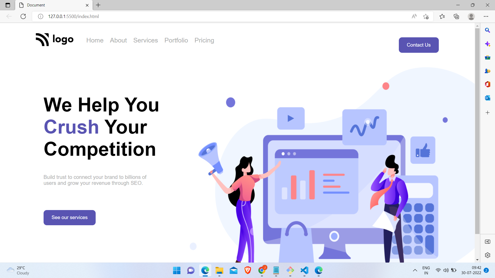

# Digital Marketing Home Page 

 

 

> Below is the Template Which is to made to be converted into website Using Pure **HTML** and **CSS**.

> ## Output with only HTML code..

> ## Output After Writting Css Code..

##   

 ## 🚀 Project 1 Live Link 
 
- This Project is been Hosted on Netlify. [Project Live Link](https://live-class-project-3.netlify.app/)

## 🛠 Skills Gained in this project

  This was the Landing page Template Design Given to convert it into ``HTML`` and ``CSS``.
 - Learnd to use css position  **[Relative & Absolute]** property.
- Learned to adjust background image to the screen.
- Learned to use Flex-Box Property

 ## ⌛ Time taken to finish this project 

 - Complete 1 hrs

### Future Scope

- Converting Into User Friendly Responsive For All the Devices.
